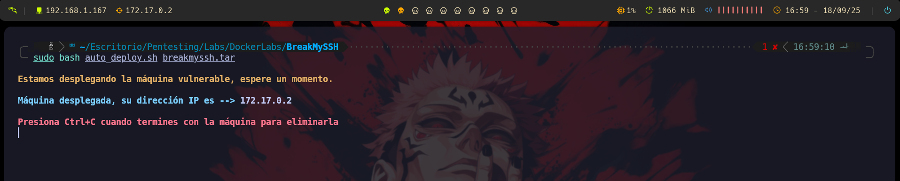
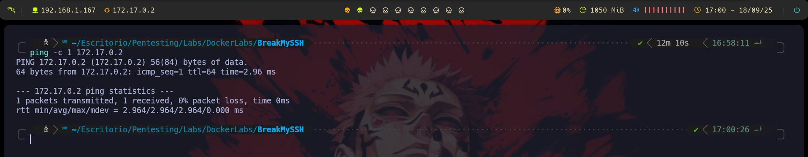
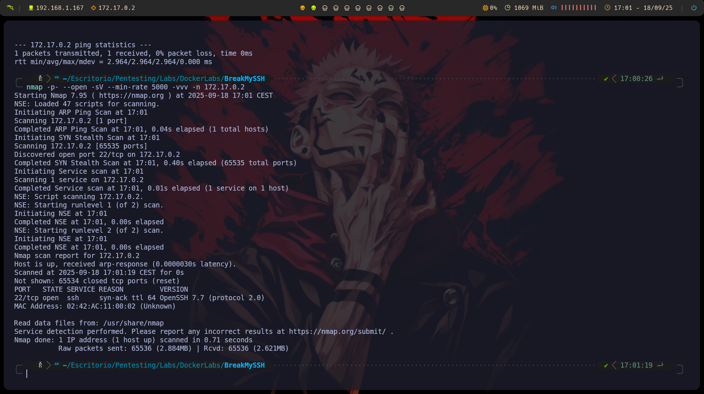
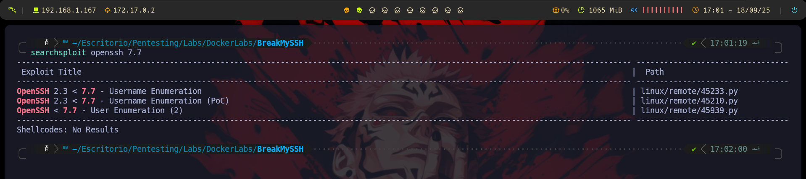
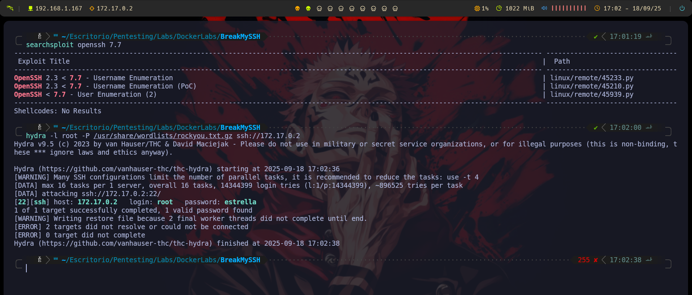
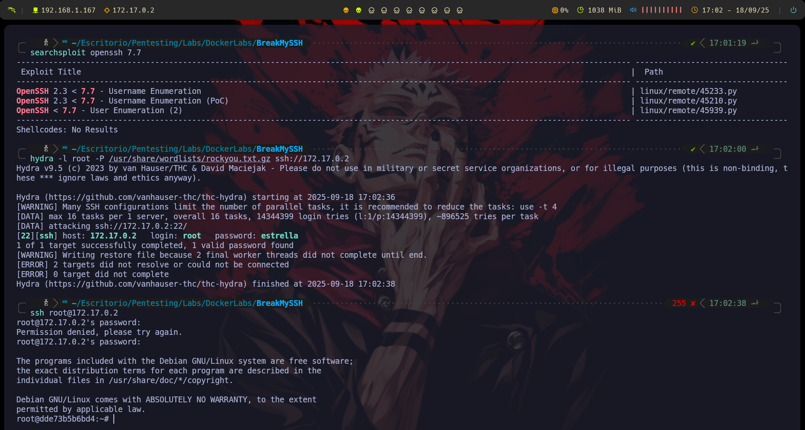
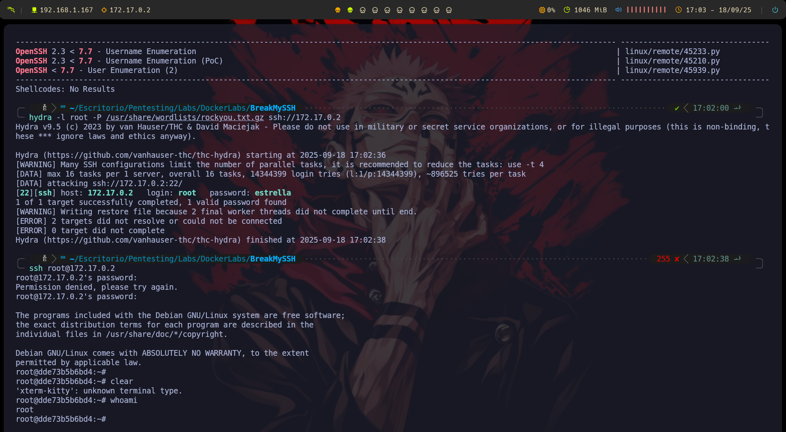

# Información de la Máqina
    ## Nombre: Breakmyssh
    ## Tipo: DockerLabs
    ## IP: 172.17.0.2
    ## Objetivo: Acceso al sistema por SSH

# 1.- Despliege
## Desplegamos el contendor de docker con el siguiente comando:

## Nos da la ip 172.17.0.2, asi que probamos la conectividad:


# 2.- Fase de Reconocimiento
## En esta fase buscamos ver que puertos estan abiertos, por lo que usando nmap procedemos a hacer el escaneo de puertos, concretamente uso este:
```bash
nmap -p- '(Todos los puertos -> 65535 p)' --open '(Solo nos interesan puertos abiertos)' -sV '(Queremos que nos muestre la version y el servicio que corren por los puertos)' --min-rate 5000 '(no queremos trabajar con tramitaciones con mas de 5000 paquetes por minuto)' -vvv '(en el momento que encuetra un puerto lo reporta por consola)' -n '(No quiero que aplique resolucion DNS)' 172.17.0.2
``` 

### Vemos que tenemos el puerto 22 abierto, que corresponde a SSH, por lo que vamos a buscar alguna vulnerabilidad dentro de la version que hemo obtenido anteriormente en la fase de reconocimiento:

### Encontramos que dentro de la version 7.7, podemos enumerar los usuarios para buscar contraseñas asociadas, por lo que probamos con root, haciendo uso de Hydra para, con fuerza bruta, buscar alguna contraseña asociada dentro de la lista rockyou:


# 3.- Contraseñas encontradas
Gracias al uso de Hydra, encotramos una contraseña asociada al usuario root, por lo que procedemos a lanzar una ssh para intentar acceder al sistema:
```bash
ssh root@172.17.0.2
```

### De forma exitosa podemos acceder al sistema, por lo que viendo que usuario somos dentro de la maquina, como era de esperar tras lanzar la ssh, somos root:


## MAQUINA TERMINADA!!!

# Conclusiones
> La máquina es vulnerable a SSH.
> La version desactualizada de SHH permite forzar las contraseñas.
> La contraseña vulnerable es del mismisimo root, lo cual no es para nada seguro.
